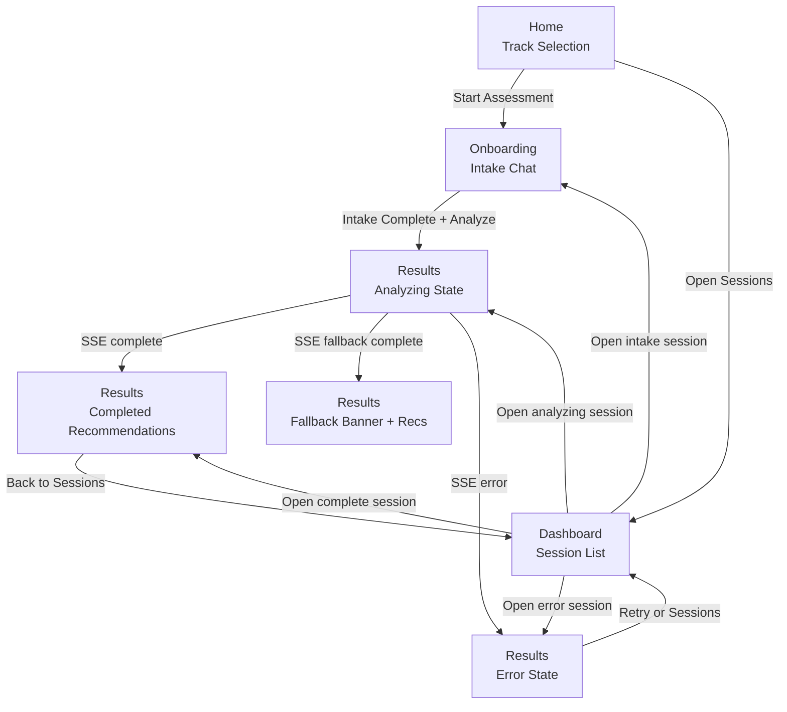

# PathFinder AI Visual Prototype Map

This document is the visual handoff companion to the UX package. It defines page-to-page transitions, component states, and responsive behavior for the current product routes.

Companion document: docs/pathfinder-ai-ux-package.md

## 1. End-to-End Prototype Map



## 2. Screen Node Map

### Home

```text
[Nav]
  - Brand
  - Home, Sessions

[Hero]
  - Title
  - Value proposition

[Track Selection Grid]
  - General card
  - Tech card (default featured)
  - Healthcare card
  - Creative card

[Primary CTA]
  - Start Assessment

[Proof Strip]
  - 12-Dimension Profile
  - AI-Scored Matches
  - Track Insights
```

### Onboarding

```text
[Top Context]
  - Track identity
  - Intake status

[Profile Progress Bar]
  - Filled dimensions count

[Chat Thread]
  - Assistant messages
  - User messages
  - Load skeletons

[Input Dock]
  - Text input
  - Send button
  - Error helper text

[Analyze Action]
  - Hidden/disabled until ready
  - Enabled when intake complete
```

### Results

```text
[Status Header]
  - Track banner
  - Fallback banner (conditional)

[Analysis State]
  - Spinner
  - Stage text
  - Progress bar + %

[Recommendation Report]
  - Featured top match card
  - Secondary cards
  - Salary + next steps
  - Why it fits + watch outs

[Recovery Actions]
  - Retry
  - Go to Sessions
  - Start new assessment
```

### Dashboard

```text
[Header]
  - Sessions title
  - Session counts
  - + New Assessment button

[Session List]
  - Session id
  - Status pill
  - Track pill
  - Message count
  - Relative updated time
  - Contextual action label

[Empty State]
  - No sessions message
  - Start first assessment CTA
```

## 3. Component State Matrix

| Component | State | Trigger | Visual Treatment | Primary Action |
|---|---|---|---|---|
| Track Card | Default | Home initial | Neutral border, muted metadata | Click to select |
| Track Card | Hover/Focus | Pointer/focus | Elevated border, stronger shadow | Enter selects |
| Track Card | Selected | Active track id | Accent border + indicator dot | Continue |
| Start Assessment CTA | Idle | Track selected | Solid accent | Start session |
| Start Assessment CTA | Loading | createSession pending | Disabled, progress label | None |
| Start Assessment CTA | Error | createSession failed | Inline error text below CTA | Retry |
| Chat Message Row | Loading | Initial session fetch | Skeleton bubbles | Wait |
| Chat Input | Idle | Onboarding ready | Active input and send | Send answer |
| Chat Input | Sending | sendMessage pending | Disabled send, spinner label | None |
| Chat Input | Error | sendMessage failed | Error helper, restored input | Retry send |
| Analyze Button | Disabled | Intake incomplete | Low emphasis | Continue questions |
| Analyze Button | Enabled | Intake complete | High emphasis | Trigger analysis |
| Analysis Panel | Running | session status analyzing | Spinner + stage + progress | Wait |
| Analysis Panel | Stream Lost | SSE closed/error | Warning text + retry path | Retry or dashboard |
| Results Header | Fallback | offline recommendation mode | Warning/amber info banner | Continue review |
| Recommendation Card | Featured | Rank 1 | Strong border-left/accent | Review details |
| Recommendation Card | Standard | Rank 2+ | Regular card border | Review details |
| Session Row | Intake | status intake | Accent status chip | Continue |
| Session Row | Analyzing | status analyzing | Warning status chip | View progress |
| Session Row | Complete | status complete | Success status chip | See results |
| Session Row | Error | status error | Danger status chip | Retry |

## 4. Responsive Behavior Map

Breakpoints:

- Mobile: 320 to 767 px
- Tablet: 768 to 1023 px
- Desktop: 1024+ px

### Home Responsive Rules

| Region | Mobile | Tablet | Desktop |
|---|---|---|---|
| Hero | 1-column, center-aligned | Wider centered block | Full hero with max-width copy |
| Track Grid | 1-column stack | 2 columns | 2x2 grid with balanced spacing |
| CTA | Full width button | Auto width centered | Auto width below cards |
| Proof Strip | Vertical cards | 2 columns + wrap | 3 columns |

### Onboarding Responsive Rules

| Region | Mobile | Tablet | Desktop |
|---|---|---|---|
| Chat Container | Narrow padding, full height | Medium padding | Centered fixed max-width |
| Bubble Width | Max 92% | Max 88% | Max 85% |
| Profile Bar | Two-line compact chips | Single line when possible | Full line with metadata |
| Input Dock | Sticky bottom, large tap targets | Sticky bottom | Inline dock with roomy spacing |

### Results Responsive Rules

| Region | Mobile | Tablet | Desktop |
|---|---|---|---|
| Header | Stack banners and title | Partial wrap | Inline banner + title block |
| Fit Score | Under role title | Right aligned if room | Right aligned fixed badge |
| Detail Sections | Vertical blocks | 2-column where possible | 2-column interior sections |
| Card Padding | Compact | Medium | Spacious |

### Dashboard Responsive Rules

| Region | Mobile | Tablet | Desktop |
|---|---|---|---|
| Header Row | Stack title and CTA | Inline with wrap | Inline single row |
| Session Row | Vertical metadata | Mixed row | Full horizontal row |
| Action Label | Full-width row footer | Right edge | Right edge fixed |
| Empty State | Single CTA block | Centered card | Centered card |

## 5. Layout Wireframes by Breakpoint

### Home - Mobile

```text
-----------------------------
| PathFinder AI      Menu    |
-----------------------------
| Find your career path      |
| short value proposition    |
|                           |
| [Tech Track Card]         |
| [General Card]            |
| [Healthcare Card]         |
| [Creative Card]           |
|                           |
| [ Start Assessment ]      |
|                           |
| [Feature Card]            |
| [Feature Card]            |
| [Feature Card]            |
-----------------------------
```

### Home - Desktop

```text
-----------------------------------------------------------------
| PathFinder AI                                     Home Sessions |
-----------------------------------------------------------------
| Hero copy block                                                    |
|                                                                    |
| [Tech] [Healthcare] [General] [Creative]                          |
|                                                                    |
|                    [ Start Assessment ]                            |
|                                                                    |
| [Feature] [Feature] [Feature]                                      |
-----------------------------------------------------------------
```

### Onboarding - Mobile

```text
-----------------------------
| Track | Intake 7/12        |
| Profile: skills values...  |
-----------------------------
| Assistant message          |
| User message               |
| Assistant message          |
| ...                        |
|                            |
-----------------------------
| [Type answer.............] |
| [Send]      [Analyze]      |
-----------------------------
```

### Onboarding - Desktop

```text
-----------------------------------------------------------------
| Track Banner | Intake State | Profile Fill Count               |
-----------------------------------------------------------------
| Assistant bubble                                               |
| User bubble                                                    |
| Assistant bubble                                               |
| ...                                                            |
|                                                                |
-----------------------------------------------------------------
| [Type your answer...........................................] [Send] |
| Profile complete 9/12                          [Analyze]            |
-----------------------------------------------------------------
```

### Results - Mobile

```text
-----------------------------
| Track Banner               |
| Fallback Banner (optional) |
| Top Career Matches         |
-----------------------------
| [Best Match Card]          |
| role + fit score           |
| summary                    |
| why it fits                |
| watch outs                 |
| salary + next steps        |
-----------------------------
| [2nd Card]                 |
| [3rd Card]                 |
-----------------------------
```

### Dashboard - Mobile

```text
-----------------------------
| Sessions                   |
| [ + New Assessment ]       |
-----------------------------
| [id] [status] [track]      |
| 14 messages 12m ago        |
| [Continue]                 |
-----------------------------
| [id] [status] [track]      |
| 9 messages 48m ago         |
| [See results]              |
-----------------------------
```

## 6. Interaction Timing and Motion Specs

- Route transition fade: 120 to 180 ms.
- Chat bubble entry: 140 ms fade + 8 px rise.
- Track selection highlight: 100 ms border and shadow ease.
- Progress bar update: 250 to 400 ms width ease-out.
- Status chip transition: 120 ms color and border transition.

Motion principle:

- Every animation must explain state change, not decorate static content.

## 7. Accessibility and Usability Acceptance

### Accessibility Checks

- All interactive controls reachable by keyboard in logical order.
- Visible focus styles on track cards, buttons, and session rows.
- Status copy remains text-based and not color-only.
- Body text and metadata pass readable contrast targets.
- Analysis and fallback states announced with clear language.

### Usability Acceptance Checks

- 80%+ of users identify the role of track selection before clicking Start.
- 90%+ of users can state current intake progress when asked.
- 80%+ of users correctly interpret analysis state as active processing.
- 80%+ of users can identify top recommendation and one tradeoff.
- 90%+ of users resume an intake session from Dashboard in under 20 seconds.

## 8. Prototype Build Order

1. Build Home with track selection states.
2. Build Onboarding with chat states and profile progress.
3. Build Results analyzing state with simulated progress stream.
4. Build Results final report card hierarchy.
5. Build Dashboard stateful session rows.
6. Run usability test tasks and record failures by screen/state.

## 9. Deliverable Outcome

Use this map as the blueprint for high-fidelity mockups or coded prototypes. It provides a single source for:

- Navigation transitions.
- Per-component state behavior.
- Responsive layout adjustments.
- Testable usability acceptance criteria.